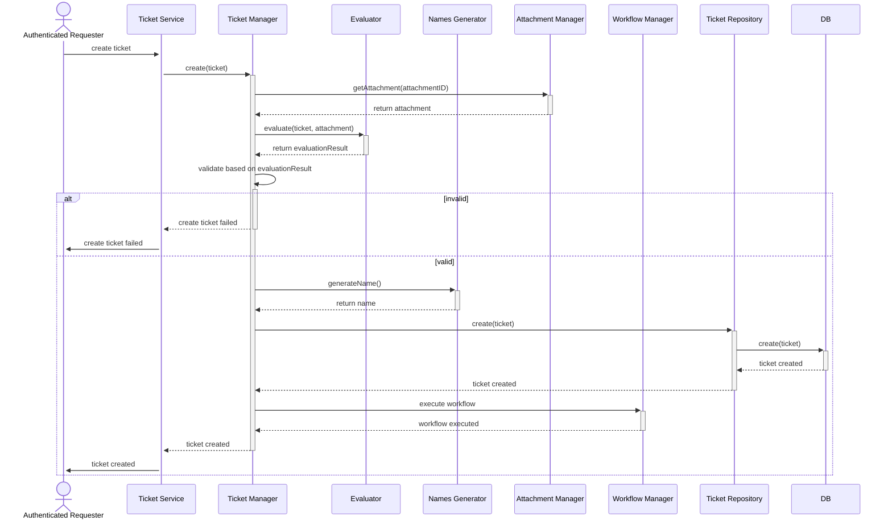

# 📔 Design docs

<figure><figcaption><p>Authenticated user create request</p></figcaption></figure>

````

```mermaid
sequenceDiagram
actor authenticated_user as Authenticated Requester
participant ticket_service as Ticket Service
participant ticket_manager as Ticket Manager
participant evaluator as Evaluator
participant names_generator as Names Generator
participant attachment_manager as Attachment Manager
participant workflow_manager as Workflow Manager
participant ticket_repo as Ticket Repository
participant db as DB

authenticated_user ->>+ ticket_service: create ticket

ticket_service ->>+ ticket_manager: create(ticket)

ticket_manager ->>+ attachment_manager: getAttachment(attachmentID)
attachment_manager -->>- ticket_manager: return attachment
ticket_manager ->>+ evaluator: evaluate(ticket, attachment)
evaluator -->>- ticket_manager: return evaluationResult
ticket_manager ->>+ ticket_manager: validate based on evaluationResult
alt invalid
    ticket_manager -->>- ticket_service: create ticket failed
    ticket_service ->>+ authenticated_user: create ticket failed
else valid
    ticket_manager ->>+ names_generator: generateName()
    names_generator -->>- ticket_manager: return name
    ticket_manager ->>+ ticket_repo: create(ticket)
    ticket_repo ->>+ db: create(ticket)
    db -->>- ticket_repo: ticket created
    ticket_repo -->>- ticket_manager: ticket created
    ticket_manager ->>+ workflow_manager: execute workflow
    workflow_manager -->>- ticket_manager: workflow executed
    ticket_manager -->>- ticket_service: ticket created
    ticket_service ->>+ authenticated_user: ticket created
end


```
````
