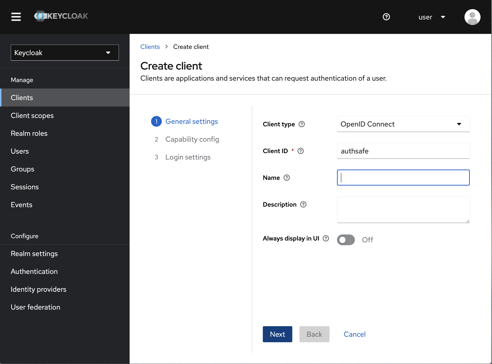

# Keycloak

These instructions will take you through the entire process of getting Authsafe authenticating with Keycloak. You will create a client within Keycloak and configure Authsafe to use Keycloak for authentication, using groups set in Keycloak to determine privileges in Authsafe.

### Creating a new client in Keycloak <a href="#creating-a-new-client-in-keycloak" id="creating-a-new-client-in-keycloak"></a>

First we need to setup a new client. Start by logging into your keycloak server, select the realm you want to use (`master` by default) and then go to **Clients** and click the **Create client** button at the top.

<figure><figcaption></figcaption></figure>

Configure the client by setting the **Root URL**, **Web origins**, **Admin URL** to the hostname (https://{hostname}).

Also you can set **Home URL** to your _/applications_ path and **Valid Post logout redirect URIs** to "+".

The Valid Redirect URIs should be set to https://{hostname}/auth/callback (you can also set the less secure https://{hostname}/\* for testing/development purposes, but it's not recommended in production).

Make sure to click **Save**.

### Configuring Authsafe OIDC <a href="#configuring-argocd-oidc" id="configuring-argocd-oidc"></a>

```
OIDC_ISSUER_URL=http://keycloak_host:keycloak_port/realms/your_realm
OIDC_CLIENT_ID=authsafe
```

### Configuring Authsafe Policy <a href="#configuring-argocd-policy" id="configuring-argocd-policy"></a>

```
g, foo@authsafe.local, role:admin
```

### Login <a href="#login" id="login"></a>

You can now login using our new Keycloak OIDC authentication.
